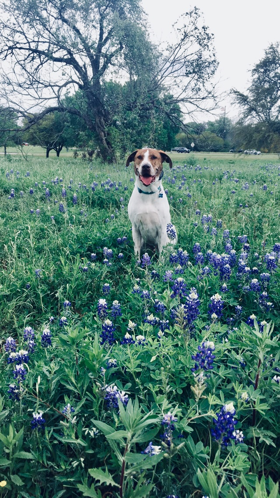

I recently graduated with a Ph.D. in Psychology (and a minor in Applied Statistical Modeling) at The University of Texas at Austin. I earned my B.S. in Cognitive Science with a specialization in Neuroscience and a minor in Philosophy from UC San Diego in 2011. I also have a M.A. in Cognitive Neuroscience, also from UT Austin (2015).

My research interests focus on learning about the developmental trajectory and stability of executive function, scientific understanding, and academic achievement in children. 

When not in the lab, I can usually be seen running, biking, swimming, or hiking with my dog, Klaus. 

### Contact me
+ [jessie.raye.bauer@gmail.com](mailto:jessie.raye.bauer@gmail.com)

{:height="40%" width="40%"}  

