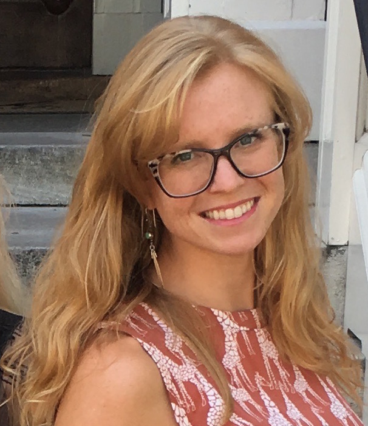
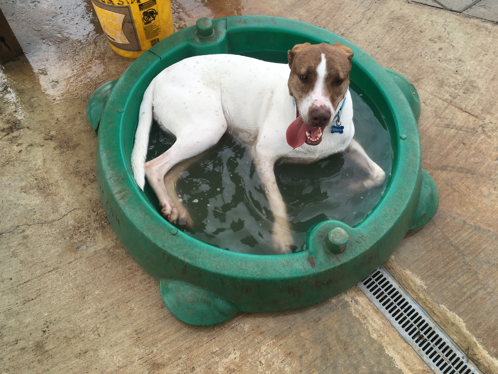

I am a fifth year Ph.D. candidate in the Developmental Psychology program at The University of Texas at Austin. I graduated from UC San Diego in 2011 with a BS in Cognitive Science with a specialization in Neuroscience and a minor in Philosophy. I also earned my Masters degree in 2015 from UT in Psychology.
{:height="20%" width="20%"} My research interests focus on learning about the developmental trajectory and stability of executive function, causal reasoning and academic achievement in young children.
When not in the lab, I can usually be seen running, biking, swimming, or hiking with my dog, Klaus.

I am also an active member of the UT Psychology Diversity Committee and a mentor in both the IE Mentorship and SURE Programs at UT. 

### Contact me

+[jessie.raye.bauer@gmail.com](mailto:jessie.raye.bauer@gmail.com)

{:height="40%" width="40%"}   

